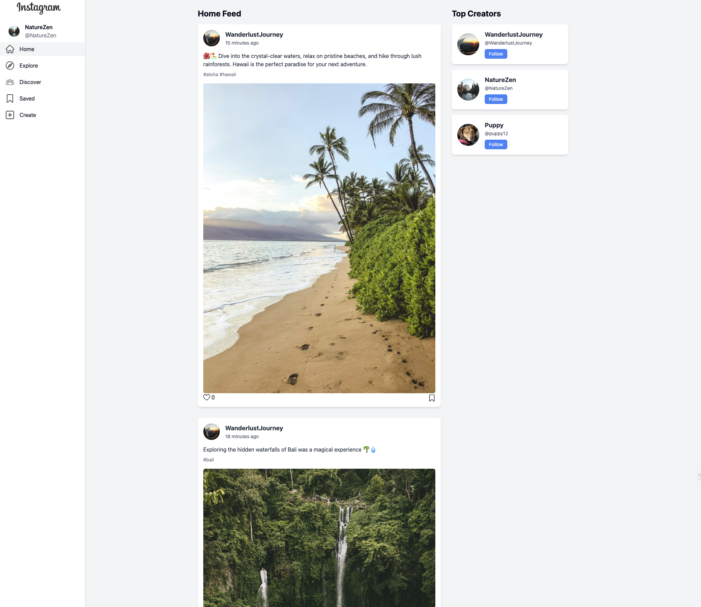
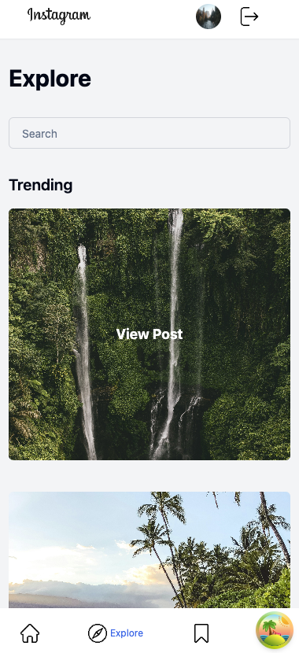

# Instagram Clone

## Description

Instagram Clone is a full-stack web application inspired by Instagram, allowing users to share photos and videos with their followers. Users can create accounts, upload posts, like and save posts, follow other users, and explore trending content.

## Features

- User authentication: Register, login, and logout securely using JSON Web Tokens (JWT).
- Profile management: Edit profile details, change profile picture, and view other users' profiles.
- Post creation: Upload photos and videos with captions, tags, and location information.
- Interaction: Like and comment on posts, follow other users, and receive notifications for interactions.
- Hashtags: Clickable hashtags to discover related content.
- Responsive design: Enjoy a seamless user experience across devices of all sizes.

## Technologies

- **Frontend**:

  - React.js: A powerful JavaScript library for building interactive user interfaces.
  - React Router: Enables seamless navigation within the application.
  - React Query: Provides advanced caching and state management for efficient data fetching.
  - JavaScript: The programming language used to build dynamic and interactive elements.

- **Backend**:

  - Appwrite: A robust backend-as-a-service (BaaS) platform used for authentication, database management, file storage, and more.

- **File Management**:

  - Appwrite Storage: Leveraged for efficient and secure file storage, enabling users to upload and manage media files seamlessly.

- **Authentication**:

  - Appwrite Auth: With Appwrite Auth, users can securely register, login, and logout of their accounts using JSON Web Tokens (JWT).

- **Other tools**:

  - Git
  - GitHub
  - Appwrite for backend deployment
  - Vercel for frontend deployment

- **Styling**:
  - Tailwind CSS: A utility-first CSS framework for creating custom designs with ease.
  - Shadcn UI: A UI toolkit used for styling the application's components, providing pre-designed elements and layouts for consistent and visually appealing user interfaces.

## Links

- Visit the deployed site [here](link-to-deployed-site).
- Access the project's Trello board [here](https://trello.com/b/XpuHwdJ5/instagram-mern-stack).
- View the Entity Relationship Diagram (ERD) [here](https://lucid.app/lucidchart/a6fc04e8-4f5d-42f0-98d8-6d4c0d3d3bab/edit?beaconFlowId=23408A01D8608450&invitationId=inv_bbf58c00-d5f8-4e25-9e6a-f4812c17c496&page=0_0#).
- View the Component Hierarchy Diagram [here](https://lucid.app/lucidchart/1c6b8ee6-b632-4835-aab7-e48f105b70a9/edit?beaconFlowId=1B606789F058EA9B&invitationId=inv_5c978f88-e6af-45bf-a65d-a899126d4d6d&page=0_0).

## Screenshots

## Future Updates

- Real-time notifications for interactions to enhance user engagement.
- Advanced search functionality with filters and sorting options for discovering content.
- Multimedia support in messaging features for richer communication experiences.
- Dark Mode: Toggle between light and dark mode for different viewing preferences.
- Messaging: Direct messaging functionality for private conversations between users.
- Comments: Allow users to comment on posts to increase engagement and interaction.

## Credits

This project was developed by Emiliya Ileeva.
